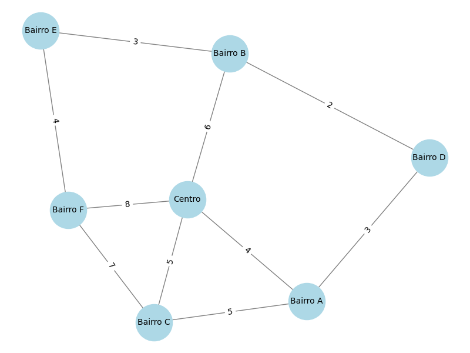

# 📌 Representação de Bairros e Ruas como um Grafo

A ideia deste exercicio é representar o trânsito de uma cidade utilizando um **grafo ponderado**, onde:
- **Os bairros** são os **vértices** do grafo.
- **As ruas entre bairros** são as **arestas**.
- **Cada rua possui um peso (distância em km)**, que permite encontrar a menor rota entre dois bairros.

## 📍 Estrutura do Grafo

O grafo é construído com base na **Lista de Adjacência**, onde cada bairro contém uma lista de bairros vizinhos e a distância até eles.

```python
{
    "Bairro D": {"Bairro A": 3, "Bairro B": 2},
    "Bairro A": {"Centro": 4, "Bairro C": 5},
    "Bairro B": {"Centro": 6, "Bairro D": 2, "Bairro E": 3},
    "Bairro C": {"Bairro A": 5, "Bairro F": 7},
    "Centro": {"Bairro A": 4, "Bairro B": 6, "Bairro F": 8, "Bairro C": 5},
    "Bairro E": {"Bairro B": 3, "Bairro F": 4},
    "Bairro F": {"Bairro C": 7, "Centro": 8, "Bairro E": 4}
}
```

## 🔗 Construção do Grafo e Visualização

O código utiliza **NetworkX** para construir e desenhar o grafo.

### 🔹 Construção do Grafo
Cada bairro é conectado aos seus vizinhos, atribuindo a distância como peso da aresta.

```python
def construir_grafo_bairros(mapa_bairros):
    """Cria um grafo ponderado (com distâncias) a partir do dicionário de bairros."""
    grafo = nx.Graph()
    for bairro, vizinhos in mapa_bairros.items():
        for vizinho, distancia in vizinhos.items():
            grafo.add_edge(bairro, vizinho, weight=distancia)
    return grafo
```

### 📷 Visualização do Grafo

A imagem abaixo representa a rede de bairros e ruas com as distâncias em km:



O código para gerar essa visualização é:

```python
def desenhar_mapa_grafo(grafo):
    """Desenha o grafo representando os bairros e as ruas com distâncias."""
    plt.figure(figsize=(8, 6))
    pos = nx.spring_layout(grafo)
    nx.draw(grafo, pos, with_labels=True, node_color='lightblue', edge_color='gray', node_size=2000, font_size=10)
    labels = nx.get_edge_attributes(grafo, 'weight')
    nx.draw_networkx_edge_labels(grafo, pos, edge_labels=labels, font_size=10)
    plt.title("Mapa de Bairros - Grafo do Trânsito com Distâncias")
    plt.show()
```

## 🛣️ Encontrando a Rota Mais Curta

Para determinar a menor rota entre dois bairros, utilizamos o **Algoritmo de Dijkstra**, que considera o peso das arestas (distância entre bairros).

```python
def encontrar_rota_mais_curta(grafo, origem, destino):
    """Encontra a menor rota entre dois bairros usando o algoritmo de Dijkstra."""
    try:
        caminho = nx.shortest_path(grafo, source=origem, target=destino, weight='weight')
        distancia = nx.shortest_path_length(grafo, source=origem, target=destino, weight='weight')
        return caminho, distancia
    except nx.NetworkXNoPath:
        return None, float('inf')
```

### ✅ Exemplo de Uso

Se quisermos encontrar a menor rota entre **Bairro A** e **Bairro E**, a execução retornará:
```text
Menor rota entre Bairro A e Bairro E: ['Bairro A', 'Bairro D', 'Bairro B', 'Bairro E'] com 8 km.
```
Isso significa que a rota mais eficiente considerando a "ponderação" de cada aresta.

## 📊 **Conclusão**

- A **Lista de Adjacência** foi a melhor escolha para representar a cidade, pois ocupa menos memória e permite buscas eficientes.
- **Dijkstra** foi utilizado para encontrar a menor rota entre dois bairros considerando as distâncias.
- O grafo foi gerado e visualizado utilizando **NetworkX** e **Matplotlib**.

Como vimos em aula, este modelo pode ser expandido considerando outros pesos como transito, tipo de via, etc.
